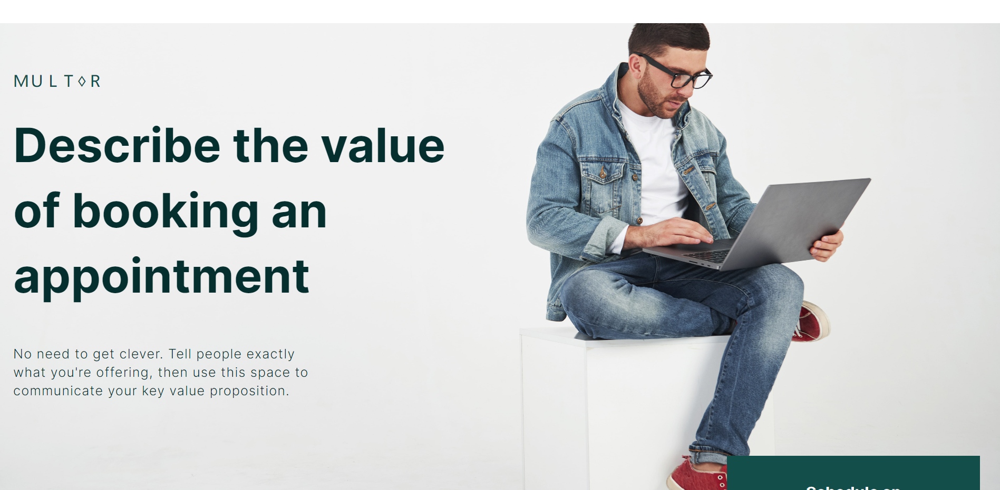
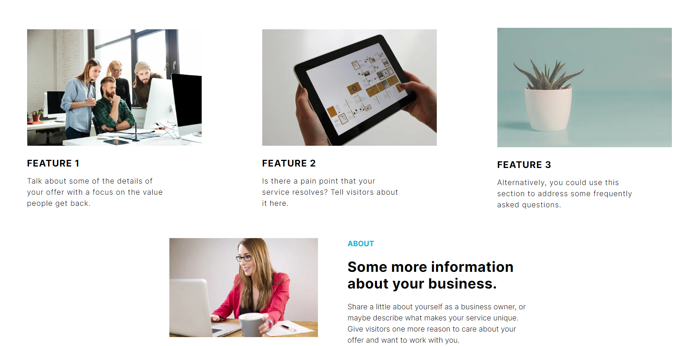
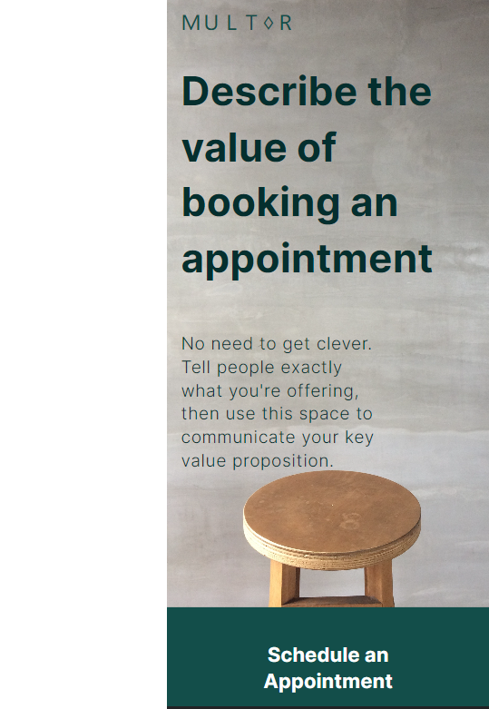
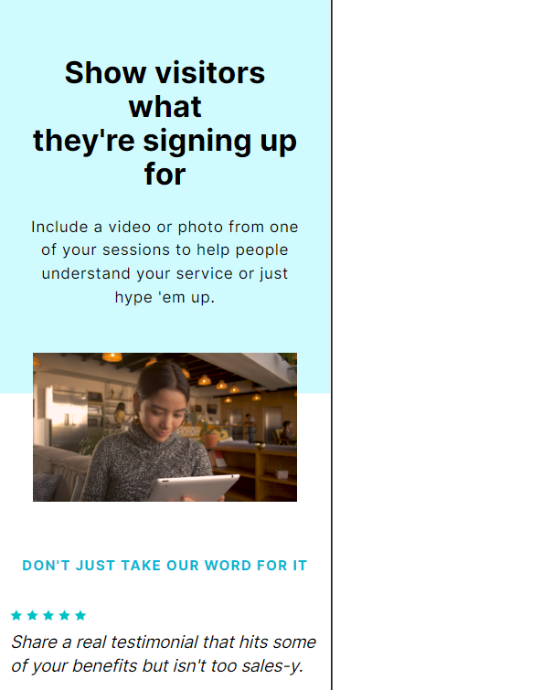

# Next.js Landing Page with Tailwind CSS

This repository contains a landing page built using Next.js and Tailwind CSS. The landing page is designed to provide a responsive and visually appealing interface.

## Features
- Responsive design for various screen sizes and devices.
- Utilizes Next.js for server-side rendering and efficient client-side navigation.
- Integrated with Tailwind CSS for easy and rapid styling customization.
- Includes optimized build configurations for production deployment.
- Supports modern JavaScript features and best practices.

## Live Link
 - https://new-landing-page-flax.vercel.app/

## Installation
Note: You have to have node installed first.
1. Clone the repository: `git clone https://github.com/virtualknight8/new-landing-page`
2. Navigate to the project directory: `cd new-landing-page`
3. Install tailwind dependencies: `npm install -D tailwindcss postcss autoprefixer`

## Usage

1. Start the development server: `npm run dev`
2. Open your browser and visit: `http://localhost:3000`

## Snapshots:
   
   
   
          

3. Video Demo:              
https://github.com/virtualknight8/new-landing-page/assets/96226262/ac0d1b38-9d0a-4d9f-9265-aca7f7353584

For more information on how to customize and extend Next.js and Tailwind CSS, refer to their respective documentation:

- Next.js: [https://nextjs.org/docs](https://nextjs.org/docs)
- Tailwind CSS: [https://tailwindcss.com/docs](https://tailwindcss.com/docs)

## License

This project is licensed under the [MIT License](LICENSE).

## Acknowledgments

- The landing page template is based on the Next.js with Tailwind CSS starter template provided by the Next.js community.
- Thanks to the contributors and maintainers of Next.js and Tailwind CSS for their excellent work and documentation.

## Contact

For any further questions or inquiries, please reach out to:

- Name: Ankit Yadav
- Email: ankitkhola2@gmail.com
- Website: https://virtualknight8.github.io/my-portfolio/

Feel free to contact me for any additional information or collaboration opportunities.
